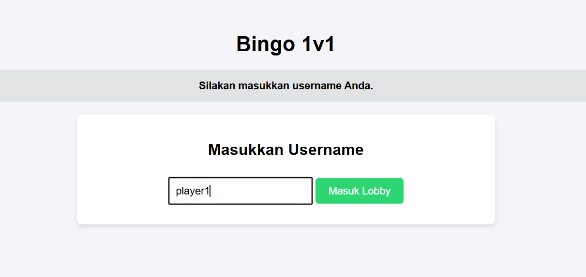

## Cara running apps

```bash
#Jalankan installer
apt install git -y
git clone https://github.com/ica4me/binggo-apps.git /root/bingo-app-new
cd /root/bingo-app-new
```
```bash
docker compose up -d --build
docker compose ps
```


Open apps 
```bash
http://<ip>:8788
```

## SreenShot Apps

